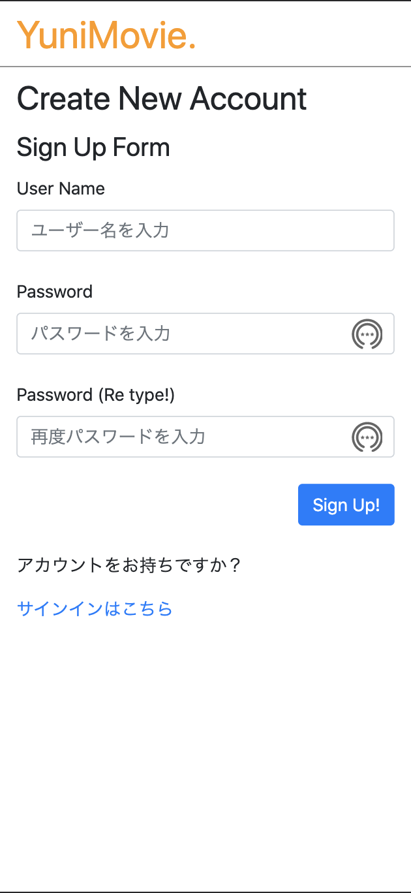
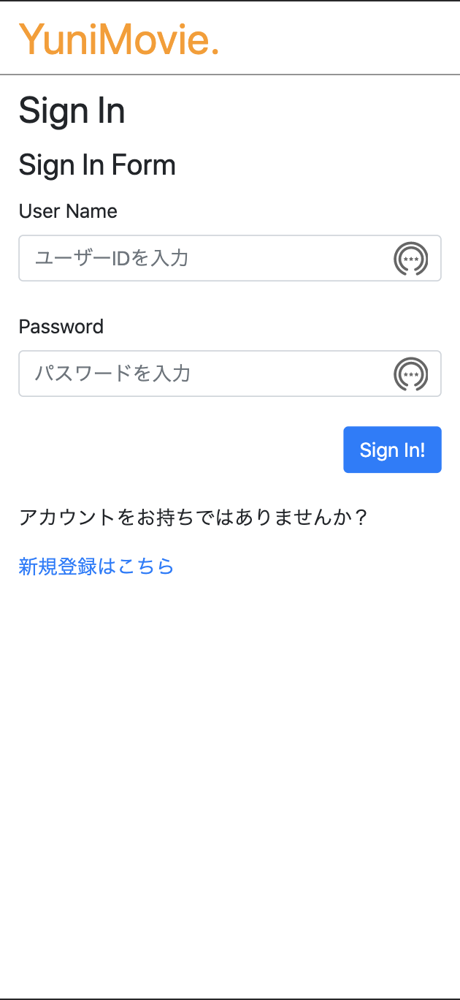
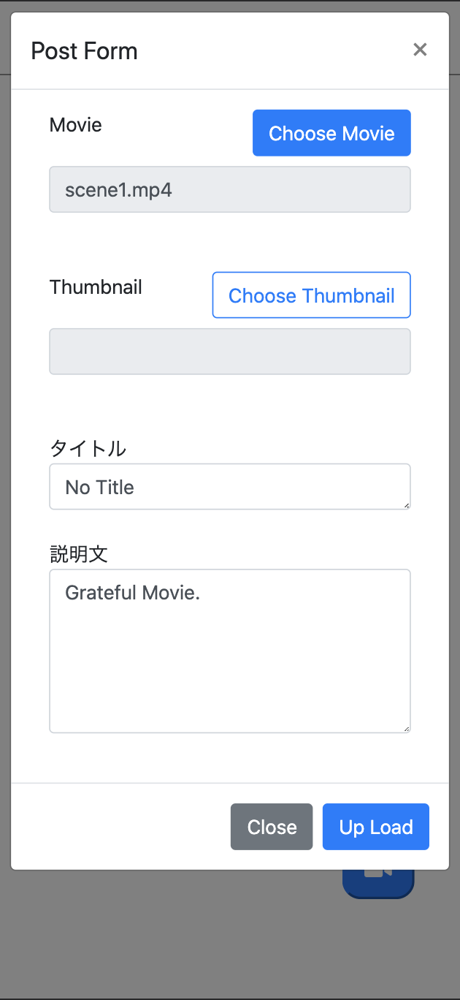
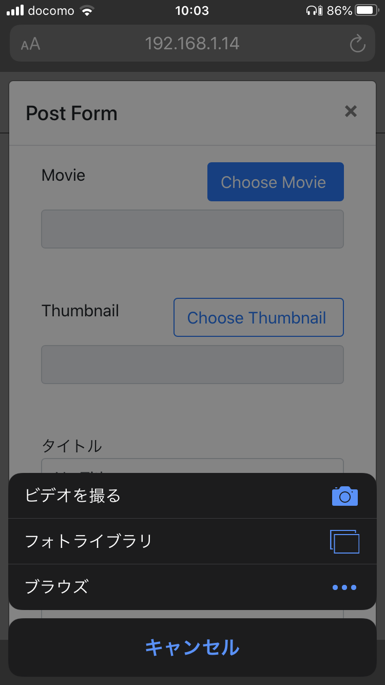
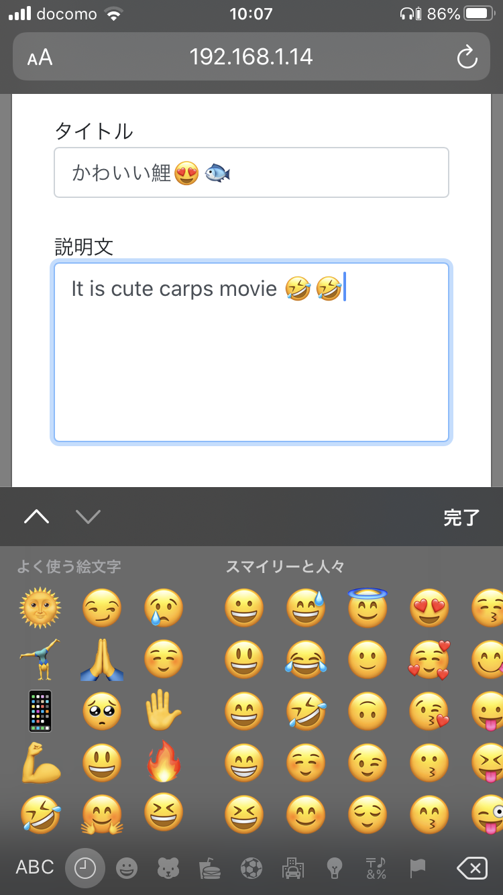
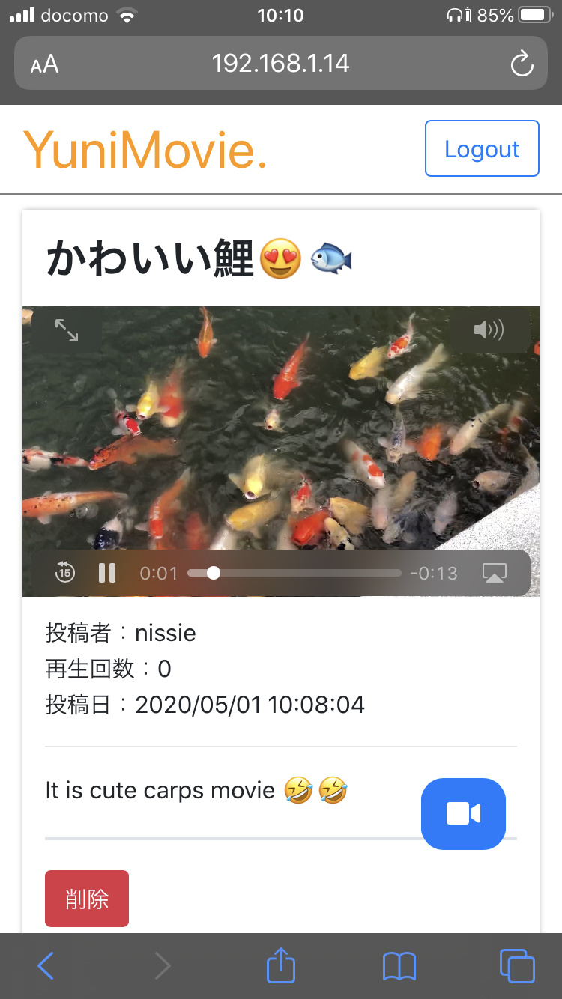
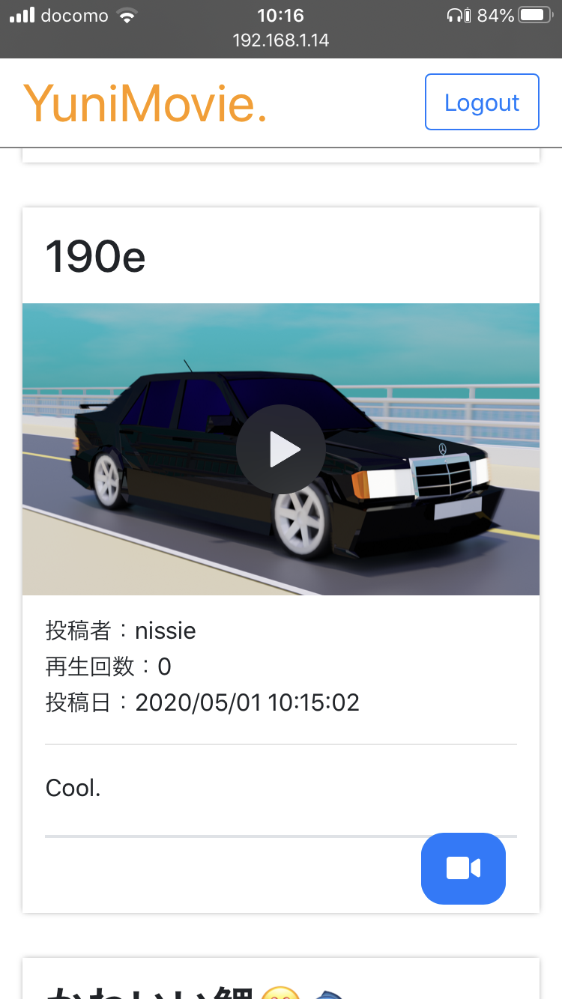

# YuniMovie. on PHP

## 動画投稿プラットフォームを作ってみた（はじめてのPHP）

### 目的
- PHPのアウトプット
- 自分の手でものを作る

### 背景
- せっかくPHPを学んだので、そのアウトプットがしたい
- 自分の手で何かしらのプラットフォームを作ったら絶対おもしろい

### 構想
- 動画配信プラットフォーム
- YouTube * twitter / 2
- モバイルファースト

### 結果（成果物）
- YouTubeの超超超下位互換の動画投稿プラットフォームがDocker上でできた。
- 最大2Gバイトの動画を投稿できる。
- MOV（iOS）形式の動画はmp4に変換される。
- プレーンなPHP製。
- セッションやクッキーとかがなんとなくわかった。
- 「テストを書く」の意味を作りきってから理解した。
- SQLインジェクション、XSS、CSRF対策を実装できた。

**※注意**<br>
**phpmyadminコンテナが4040ポートで公開されているので、セキュリティーはガバガバです。**


### 将来したいこと
- 機能の追加
  - いいね機能
  - 共有機能
  - コメント機能
  - 配信機能
  - 退会機能
- UI/UX体験の向上
- アップロード中がわかるUI
- 新規登録直後のルーティング？の設計と構築
- テスト概念の導入
- CircleCIとの連携
- AWSにてデプロイ
- etc..

### ギャラリー
- 最初のゲストユーザーのメイン画面<br>


- サインアップ<br>


- ログイン<br>


- 最初のログインユーザーのメイン画面<br>


- 投稿画面<br>


- 動画の選択<br>


- 説明文の記述<br>


- メイン画面（動画の再生、削除ができる）<br>


- 他ユーザーは削除できない（削除ボタンが消える）<br>


### 制作期間
#### 全工数
- 約1か月

#### 構想
- 2020 3/30 ~ 3/31

#### コーディング
- 2020 4/1 ~ 5/1

### 進捗
#### 2020 4/9
- 動画の投稿＆削除ができるようになった

#### 2020 4/20
- CSRF対策
- HTMLファイルのテンプレート化
- ログイン機能の実装
  - 投稿ユーザーの登録機能
  - 投稿したユーザーと動画の紐付け
- UIの整備

#### 2020 4/23
- デファクタリング（主にカプセル化）

#### 2020 4/24
- カプセル化完了
- 投稿者の表示
- 再生回数機能の実装
- UIの整備

#### 2020 5/1
- タイトル、説明欄にデフォルト値を設定
- 開発停止

#### Next
- railsで作り直す（かも）


### 構築方法
#### .env
以下の内容のような.envファイルをプロジェクトのルートに作成します。

```env:.env
MYSQL_ROOT_PASSWORD=password
MYSQL_USER=yunimovie
MYSQL_PASSWORD=password
MYSQL_DATABASE=yunimovie
```

#### Docker

```
$ docker-compose up -d --build
```

#### DBの初期化
DBのマイグレーションシステムはないので、手動でテーブルを用意する必要があります。

##### MySQLの設定
まずは、PHPのための設定。


```
$ docker container exec -it yunimovie_mysql mysql -u root -p
Enter password: <MYSQL_ROOT_PASSWORDで設定した値>
```

以下を実行します。


```sql
ALTER USER '<MYSQL_USERで設定した値>'@'%' IDENTIFIED WITH mysql_native_password BY '<MYSQL_PASSWORDで設定した値>';
```

以下のコマンドの結果で、rootや<MYSQL_USER>のpluginカラムがmysql_native_passwordになっていればOKです。

```
mysql> use mysql;

mysql> select user, host, plugin from user;
+------------------+-----------+-----------------------+
| user             | host      | plugin                |
+------------------+-----------+-----------------------+
| root             | %         | mysql_native_password |
| mysql.infoschema | localhost | caching_sha2_password |
| mysql.session    | localhost | caching_sha2_password |
| mysql.sys        | localhost | caching_sha2_password |
| root             | localhost | mysql_native_password |
+------------------+-----------+-----------------------+
5 rows in set (0.00 sec)

```

##### テーブルの作成
phpmyadminなどから以下のテーブルを作成します。
yunimovieデータベースに作成します。（yunimovieDB自体はdockercompose.ymlで作成済み）

- 作成するテーブル
  - userData
  - movie

###### userData
|名前|データ型|照合順序|NULL|その他|
|---|---|---|---|---|
|id|int||いいえ|AUTO_INCERMENT|
|name|varchar(256)|utf8mb4_general_ci|いいえ||
|password|varchar(256)|utf8mb4_general_ci|いいえ||

```
mysql> use <MYSQL_DATABASEで設定した値>
```

```sql
CREATE TABLE `yunimovie`.`userData` ( `id` INT NOT NULL AUTO_INCREMENT , `name` VARCHAR(256) CHARACTER SET utf8mb4 COLLATE utf8mb4_general_ci NOT NULL , `password` VARCHAR(256) CHARACTER SET utf8mb4 COLLATE utf8mb4_general_ci NOT NULL , PRIMARY KEY (`id`)) ENGINE = InnoDB;
```

###### movie
|名前|データ型|照合順序|NULL|その他|
|---|---|---|---|---|
|id|int||いいえ|AUTO_INCERMENT|
|title|varchar(256)|utf8mb4_general_ci|いいえ||
|url_movie|varchar(256)|utf8mb4_general_ci|いいえ||
|url_thumbnail|varchar(256)|utf8mb4_general_ci|いいえ||
|explanation|text|utf8mb4_general_ci|いいえ||
|upLoadDate|datetime||いいえ||
|viewCount|id||いいえ||
|user_id|id||いいえ||

```sql
CREATE TABLE `yunimovie`.`movie` ( `id` INT NOT NULL AUTO_INCREMENT , `title` VARCHAR(256) CHARACTER SET utf8mb4 COLLATE utf8mb4_general_ci NOT NULL , `url_movie` VARCHAR(256) CHARACTER SET utf8mb4 COLLATE utf8mb4_general_ci NOT NULL , `url_thumbnail` VARCHAR(256) CHARACTER SET utf8mb4 COLLATE utf8mb4_general_ci NOT NULL , `explanation` TEXT NOT NULL , `upLoadDate` DATETIME NOT NULL , `viewCount` INT NOT NULL , `user_id` INT NOT NULL , PRIMARY KEY (`id`)) ENGINE = InnoDB;
```
